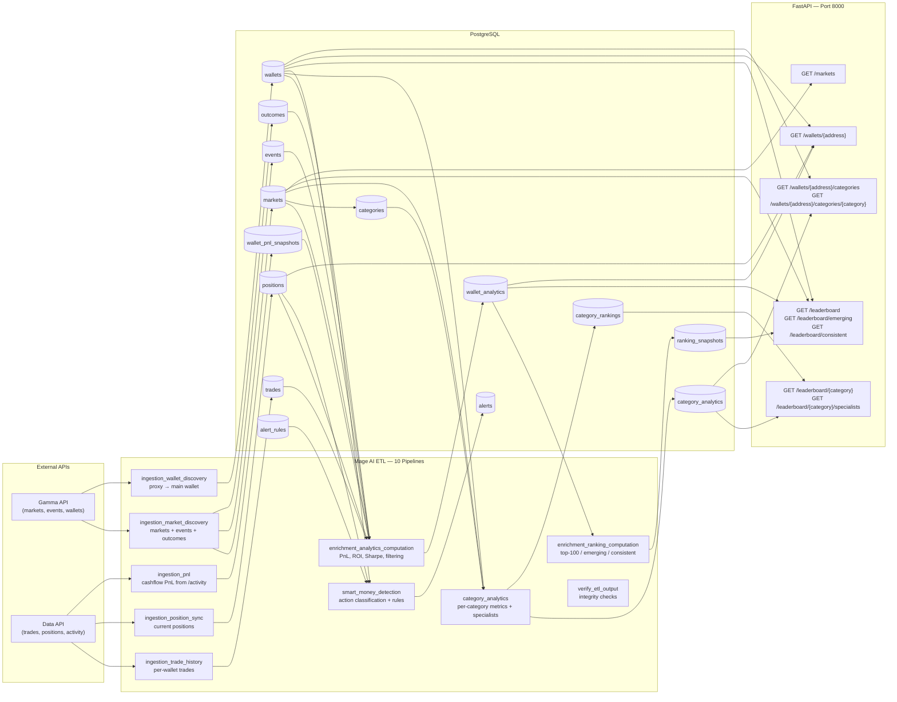

# Polymarket Smart Money Tracker


Identify the most skilled Polymarket traders, measure their performance by niche, detect when they open new positions, and generate actionable alerts.

> **Status:** Phase 3 — Smart Money Detection ✅ Complete (Action Classification, Alert REST API, WebSocket Streaming, Discord Delivery, Alert Testing Suite)

---

## Architecture



---

## Quick Start

```bash
# Start all services
docker compose up -d

# Run database migrations
docker compose exec app alembic upgrade head

# (Optional) Seed with pre-computed data to skip ETL pipelines (~30 min)
# docker compose exec postgres psql -U app -d polymarket < docker/initdb/seed.sql.gz

# Check health
curl http://localhost:8000/health

# Browse API
curl http://localhost:8000/api/v1/leaderboard
curl http://localhost:8000/api/v1/markets
curl http://localhost:8000/api/v1/wallets/0x...
curl http://localhost:8000/docs
```

Then open **Mage AI** at `http://localhost:6789` to create ETL pipelines that pull data from Polymarket APIs into PostgreSQL.

---

## Services

| Service | Port | Description |
|---------|------|-------------|
| **FastAPI** | `8000` | REST API for leaderboard, wallets, markets |
| **Mage AI** | `6789` | ETL orchestration (data loaders → transformers → exporters) |
| **PostgreSQL** | `5432` | Primary database |
| **Redis** | `6379` | Cache and rate-limit tracking |

---

## Development

### Prerequisites

- Python 3.12+
- Docker & Docker Compose

### Local Setup

```bash
# Start infrastructure (PostgreSQL + Redis)
docker compose up -d postgres redis

# Create virtual environment
python3 -m venv .venv
source .venv/bin/activate

# Install dependencies
pip install -r requirements.txt

# Run migrations
alembic upgrade head

# Start the app
uvicorn app.main:app --reload
```

### Testing

The project has four test suites:

```bash
# Unit / API tests (mocked, no Docker needed)
python -m pytest app/tests/test_api/ -v

# Service / classifier unit tests (mocked, no Docker needed)
python -m pytest app/tests/test_alert_service.py app/tests/test_ws_manager.py -v

# Integration tests (requires docker compose up -d)
python -m pytest app/tests/test_db_integrity.py -m integration -v

# Run all tests
python -m pytest app/tests/ -v

# With coverage
python -m pytest app/tests/ --cov=app -v
```

The **149 tests** (93 unit/API + 56 integration) validate row counts, referential integrity,
not-null constraints, data quality ranges, timestamp sanity, cross-table consistency,
data filtering, alert classification logic, Discord delivery, and WebSocket streaming —
with all CI checks enforced via GitHub Actions (`mypy --strict` + `ruff`).

### Code Quality

```bash
# Lint
ruff check app/

# Type check
mypy app/ --strict

# Pre-commit (install once)
pre-commit install
pre-commit run --all-files
```

---

## Project Structure

```
.
├── docker-compose.yml           # PostgreSQL + Redis + Mage + app
├── Dockerfile                   # FastAPI app image
├── requirements.txt             # Python dependencies
├── pyproject.toml               # Ruff, MyPy, Pytest config
├── .pre-commit-config.yaml      # Pre-commit hooks
│
├── app/                         # FastAPI backend
│   ├── main.py                  # App factory, /health endpoint
│   ├── config.py                # pydantic-settings
│   ├── api/
│   │   ├── router.py            # Route aggregation
│   │   ├── dependencies.py      # DB session dependency
│   │   └── v1/
│   │       ├── leaderboard.py   # GET /leaderboard, /emerging, /consistent
│   │       ├── wallets.py       # GET /wallets/{address}
│   │       ├── markets.py       # GET /markets
│   │       └── categories.py    # GET /categories, /leaderboard/{category}, /wallets/{addr}/categories
│   ├── db/
│   │   ├── engine.py            # AsyncEngine + session factory
│   │   └── models.py            # SQLAlchemy ORM (10 tables)
│   ├── services/
│   │   ├── alert_service.py     # Discord delivery, action classification
│   │   ├── category_service.py  # Category leaderboards, wallet breakdown
│   │   ├── category_classifier.py  # Thin wrapper around keyword classifier
│   │   ├── leaderboard_service.py
│   │   ├── wallet_service.py
│   │   └── ws_manager.py        # WebSocket connection manager
│   ├── models/
│   │   ├── schemas.py           # Pydantic response models
│   │   └── enums.py             # TradeSide, MarketCategory
│   └── tests/
│       ├── __init__.py
│       ├── conftest.py              # Mock DB fixtures
│       ├── test_alert_service.py    # Alert delivery service tests (39)
│       ├── test_category_classifier.py  # Phase 2 classifier unit tests
│       ├── test_ws_manager.py       # WebSocket manager tests (14)
│       ├── test_api/
│       │   ├── __init__.py
│       │   ├── test_endpoints.py
│       │   ├── test_alert_endpoints.py  # Phase 3 alert API tests (13)
│       │   └── test_category_endpoints.py  # Phase 2 category API tests
│       └── test_db_integrity.py   # 56 integration tests
│
├── alembic/                     # Database migrations
│   ├── env.py
│   ├── script.py.mako
│   └── versions/
│       ├── 001_initial.py
│       ├── 002_category_analytics.py
│       ├── 003_add_mapped_category.py
│       ├── 004_add_categories_table.py
│       ├── 005_smart_money_alerts.py
│       ├── 006_drop_outcome_id_fks.py
│       └── 007_add_wallet_pnl_snapshots.py
│
├── mage/                        # Mage AI (bootstrapped on startup)
│   ├── Dockerfile
│   └── requirements.txt
│
└── .opencode/
    ├── agents/                  # OpenCode agents
    ├── commands/                # Custom commands
    └── plans/                   # Phase specifications (for coding agents)
        ├── db-seed-dump.md
        ├── phase-01/
        │   ├── 01-database-redesign.md
        │   ├── 02-etl-pipelines.md
        │   ├── 03-events-population.md
        │   ├── 04-wallet-filtering.md
        │   ├── 05-mvp-leaderboard.md
        │   ├── 06-ci-cd-setup.md
        │   ├── 07-trade-history-fix.md
        │   ├── 08-pipeline-orchestration-and-verification.md
        │   └── 09-signoff.md
        └── phase-02/
            ├── 01-database-schema.md
            ├── 02-category-mapping.md
            ├── 03-etl-pipeline.md
            ├── 04-api-endpoints.md
            ├── 05-testing.md
            └── 06-signoff.md
```

---

## API Reference

### `GET /health`

Health check.

### `GET /api/v1/leaderboard`

Top 100 traders ranked by skill score.

| Param | Type | Default | Description |
|-------|------|---------|-------------|
| `limit` | int | 100 | Results per page (max 500) |
| `offset` | int | 0 | Pagination offset |

### `GET /api/v1/leaderboard/emerging`

Top 10 emerging traders.

### `GET /api/v1/leaderboard/consistent`

Top 10 most consistent traders.

### `GET /api/v1/wallets/{address}`

Full wallet profile with analytics and current positions.

### `GET /api/v1/markets`

List known markets.

| Param | Type | Default | Description |
|-------|------|---------|-------------|
| `category` | string | — | Filter by category |
| `limit` | int | 50 | Results per page (max 500) |
| `offset` | int | 0 | Pagination offset |

### `GET /api/v1/categories`

List all 8 market categories with their labels.

### `GET /api/v1/leaderboard/{category}`

Top traders in a specific category, ranked by skill score.

| Param | Type | Default | Description |
|-------|------|---------|-------------|
| `category` | string | — | One of `politics`, `crypto`, `sports`, `economics`, `technology`, `ai`, `geopolitics`, `entertainment` |
| `limit` | int | 50 | Results per page (max 200) |
| `offset` | int | 0 | Pagination offset |

**Example response:**

```json
{
  "category": "politics",
  "data": [
    {
      "rank": 1,
      "wallet": "0x17e5...",
      "wallet_score": 0.85,
      "roi": 41.29,
      "win_rate": 0.62,
      "total_pnl": 37053.07,
      "num_trades": 840,
      "total_volume": 89730.34,
      "is_specialist": true
    }
  ],
  "limit": 50,
  "offset": 0
}
```

### `GET /api/v1/leaderboard/{category}/specialists`

Specialist traders in a category (wallets with >30 trades and above-median ROI).

Same response shape as the main category leaderboard, filtered to specialists only.

### `GET /api/v1/wallets/{address}/categories`

Per-category performance breakdown for a wallet.

**Example response:**

```json
{
  "wallet": "0x17e5...",
  "categories": [
    {
      "category": "politics",
      "num_trades": 840,
      "total_volume": 89730.34,
      "total_pnl": 37053.07,
      "roi": 41.29,
      "win_rate": 0.62,
      "profit_factor": 3.21,
      "avg_position_size": 106.82,
      "is_specialist": true,
      "category_rank": 1
    }
  ]
}
```

### `GET /api/v1/wallets/{address}/categories/{category}`

Detailed analytics for a specific wallet+category combination.

**Example response:**

```json
{
  "wallet": "0x17e5...",
  "category": "politics",
  "num_trades": 840,
  "total_volume": 89730.34,
  "total_cost_basis": 52300.00,
  "total_pnl": 37053.07,
  "total_realized_pnl": 28000.00,
  "total_unrealized_pnl": 9053.07,
  "roi": 41.29,
  "win_rate": 0.62,
  "profit_factor": 3.21,
  "avg_position_size": 106.82,
  "avg_holding_duration": "7 days, 3:42:00",
  "is_specialist": true,
  "category_rank": 1
}
```

---

### `GET /api/v1/alerts`

List detected smart money alerts.

| Param | Type | Default | Description |
|-------|------|---------|-------------|
| `limit` | int | 50 | Results per page (max 200) |
| `offset` | int | 0 | Pagination offset |
| `category` | string | — | Filter by category (case-insensitive) |
| `min_score` | decimal | — | Minimum wallet score |
| `wallet` | string | — | Partial-match filter on wallet address |

**Example response:**
```json
{
  "data": [
    {
      "id": "a1b2c3d4-...",
      "wallet": "0x1234...",
      "market_id": "12345",
      "market_question": "Will candidate X win?",
      "action": "NEW_POSITION",
      "price": "0.420000000000",
      "position_size": "12000.00",
      "wallet_score": "89.500000",
      "category": "Politics",
      "detected_at": "2026-06-24T12:00:00Z",
      "notified_at": null
    }
  ],
  "limit": 50,
  "offset": 0
}
```

### `GET /api/v1/alerts/{wallet}`

Alerts for a specific wallet address (paginated).

### `GET /api/v1/alerts/stats`

Aggregated alert statistics.

**Example response:**
```json
{
  "total_alerts": 142,
  "alerts_today": 12,
  "top_categories": [
    {"category": "Politics", "count": 58},
    {"category": "Crypto", "count": 43}
  ],
  "top_wallets": [
    {"wallet": "0x1234...", "alert_count": 15},
    {"wallet": "0xabcd...", "alert_count": 10}
  ]
}
```

### `WS /api/v1/alerts/ws`

Real-time WebSocket stream of new smart money alerts. The server sends heartbeat pings (`{"type": "ping"}`) and alert payloads (`{"type": "alert", "payload": {...}}`). Clients should respond with `{"type": "pong"}` to keep the connection alive.

---

## Database Schema

| Table | Purpose |
|-------|---------|
| `markets` | Market metadata (question, category, outcomes, resolution) |
| `trades` | Individual trade records (wallet, market, side, price, shares) |
| `wallets` | Wallet identity with proxy wallet mapping |
| `positions` | Current open positions (avg entry, shares, PnL) |
| `wallet_pnl_snapshots` | Cashflow-reconstructed PnL from `/activity` endpoint |
| `wallet_analytics` | Daily snapshots of computed metrics and ranking scores |
| `category_analytics` | Per-wallet, per-category PnL, ROI, win rate, specialist flags |
| `category_rankings` | Top-50 rankings per category (+ specialist lists) |
| `categories` | Lookup table for the 8 target categories |
| `alerts` | Detected high-signal trading events (smart money) |
| `alert_rules` | Configurable threshold configuration for alert generation |

---

## Phases

| Phase | Status | Description |
|-------|--------|-------------|
| 0 — Feasibility Study | ✅ Complete | Data source validation, rate limits, architecture |
| 1 — MVP Leaderboard | ✅ Complete | FastAPI backend + Mage ETL pipelines |
| 2 — Niche Expertise | ✅ Complete | Category-specific rankings and specialist detection |
| 3 — Smart Money Detection | ✅ Complete | Action classification, alert rules engine, PnL cash-flow reconstruction, REST API (`GET /api/v1/alerts`), WebSocket stream (`WS /api/v1/alerts/ws`), Discord delivery service, alert testing suite |
| 4 — Edge Scoring | 📋 Planned | Predictive accuracy metrics |
| 5 — Recommendation Engine | 📋 Planned | Follow recommendations |
| 6 — Dashboard | 📋 Planned | Next.js frontend |
| 7 — Advanced Features | 📋 Planned | ML, clustering, portfolio simulation |

See [ROADMAP.md](ROADMAP.md) for full details.
