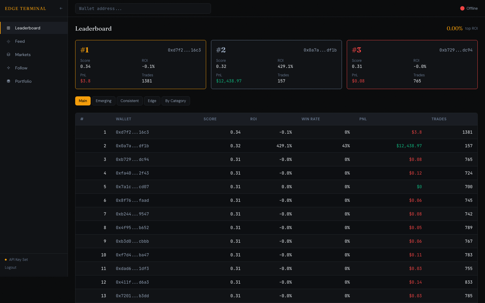
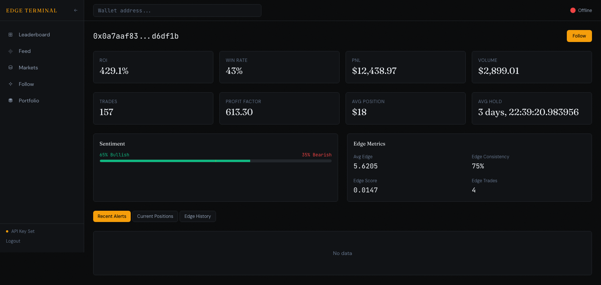
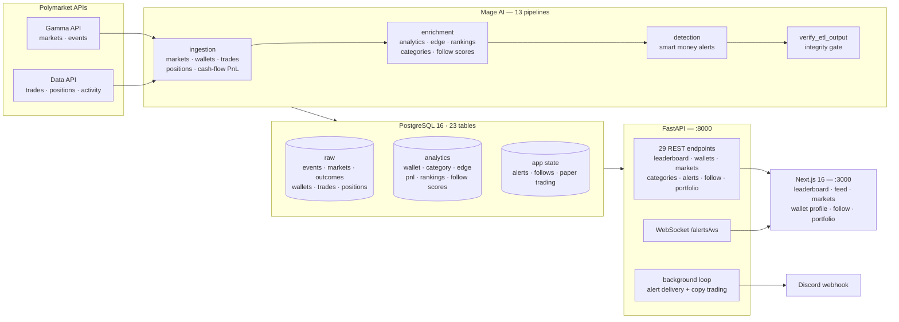

# Edge Terminal — Polymarket Smart Money Tracker

[](https://github.com/AntoineROYERB/polymarketpricer/actions/workflows/ci.yml)
[](LICENSE)
[](https://www.python.org/)
[](https://nextjs.org/)

Polymarket settles every prediction market in public, on-chain: every trade, every
position, every payout. That makes it one of the few venues where trader skill can be
measured rather than claimed.

**Edge Terminal ranks Polymarket wallets by measured predictive skill, tracks which
niches they are actually good at, streams an alert when one of them opens a position,
and paper-trades the copy so the strategy can be evaluated before any real money moves.**

<p align="center">
  
  <br>
  <em>Leaderboard — wallets ranked by composite skill score</em>
</p>

<p align="center">
  
  <br>
  <em>Wallet profile — performance, sentiment split and edge metrics</em>
</p>

---

## Why there is no hosted demo

Polymarket's APIs are geo-blocked in France, where this project is developed and where
I live. Rather than build against a service I could not reach, the whole system is
designed to run entirely on a laptop:

- **`docker compose up` gives you a working instance with real data.** A 3 MB sampled
  snapshot of the production database (200 wallets, 24k trades, 1.3k markets, plus every
  derived analytics table) is committed to the repo and loaded on first boot. No API
  access needed to explore the app, the API, or the dashboard.
- The ETL layer that *does* need Polymarket is isolated behind Mage AI pipelines. It is
  fully implemented and documented, and it is what produced the snapshot — but nothing
  else in the stack depends on it being reachable.

That constraint drove a design worth having anyway: a hard boundary between ingestion and
everything downstream, and a repo you can run offline in one command.

---

## What it does

### 1. Rank traders by measured skill, not by PnL

A wallet that turned $1M into $1.1M is not more skilled than one that turned $1k into
$5k. The composite **wallet score** deliberately weights *edge* over raw profit:

```
wallet_score = 0.40 · edge_score          # predictive accuracy (see below)
             + 0.20 · consistency_score   # 1 / (1 + CV of trade PnLs), ≥10 trades
             + 0.20 · normalized_roi
             + 0.10 · experience_score
             + 0.10 · normalized_sharpe
```

Three leaderboards fall out of it: **top 100**, **emerging** (mid-experience wallets on
the way up, before they surface in the top 100), and **consistent** (lowest-variance
returns).

### 2. Edge scoring — is the wallet actually predicting anything?

`edge_score` is the part that resists luck. Trades are matched FIFO into closed
round-trips, each one yielding an edge of `(exit_price − entry_price) / entry_price`,
and a wallet's average edge is min-max normalized across the population. Alongside it,
`edge_consistency` reports the share of round-trips with positive edge — separating
"right often" from "right once, hugely".

### 3. Niche expertise

Aggregate ROI hides everything. Markets are classified into categories (politics,
sports, crypto, …) by a keyword classifier, and every metric is recomputed per category.
A wallet is flagged a **specialist** in a category when its performance there stands
apart from its own baseline — so you can follow someone for their good niche instead of
their whole book.

### 4. Smart money alerts

An ETL pass classifies each position change (`OPEN` / `INCREASE` / `DECREASE` / `CLOSE`),
filters it through a rules engine (minimum wallet score, position size, market liquidity,
per-wallet cooldown) and emits an alert. Delivery runs as a background task on the API:
**WebSocket** broadcast to connected dashboards and a **Discord** webhook embed enriched
with the wallet's follow context.

### 5. Follow list and paper trading

Follow a wallet with a copy mode (`fixed` amount, `proportional`, or `percentage` of
portfolio) and an optional category filter. Alerts on followed wallets execute against a
**paper portfolio** — positions, fills, realized and unrealized PnL, market-resolution
handling — so a copy strategy can be measured before it costs anything.

The **follow score** turns all of the above into a single `FOLLOW` / `WATCH` / `IGNORE`
recommendation, per wallet and per category:

```
follow_score = 0.30 · edge + 0.20 · consistency + 0.20 · specialization
             + 0.15 · recency (e^(−days/90)) + 0.15 · frequency (sigmoid, trades/month)
```

Weights, thresholds and decay constants live in a single module
([`app/services/scoring_constants.py`](app/services/scoring_constants.py)) shared by the
async API layer, the pandas ETL layer and the tests — so the three implementations of the
formula cannot drift apart.

---

## Architecture



Detail in [docs/ARCHITECTURE.md](docs/ARCHITECTURE.md).

---

## Stack

| Layer | Choices |
|---|---|
| **API** | FastAPI · SQLAlchemy 2 (async) · asyncpg · Pydantic v2 · slowapi rate limiting · Bearer-token auth on write endpoints |
| **Database** | PostgreSQL 16 · Alembic (21 migrations) · `NUMERIC(28,12)` throughout — no floats in money paths |
| **ETL** | Mage AI · pandas · 13 pipelines (loaders → transformers → exporters) with an integrity gate that fails the run on bad output |
| **Frontend** | Next.js 16 (App Router) · React 19 · TypeScript · Tailwind 4 · shadcn/ui · TanStack Query · Recharts |
| **Quality** | 281 Python tests (unit · API · integration) · Vitest component tests · `ruff` · `mypy --strict` · `bandit` · `safety` · pre-commit |
| **Ops** | Docker Compose (4 services) · GitHub Actions CI on every push and PR |

---

## Quick start

Requires Docker and Docker Compose. No Polymarket API access needed.

```bash
git clone https://github.com/AntoineROYERB/polymarketpricer.git
cd polymarketpricer
cp .env.sample .env
sed -i '' "s/^API_KEY=.*/API_KEY=$(openssl rand -hex 32)/" .env   # Linux: sed -i
docker compose up -d
```

PostgreSQL loads `docker/initdb/seed.sql.gz` on first boot, so the stack comes up
populated. Then:

| URL | What |
|---|---|
| http://localhost:3000 | Dashboard |
| http://localhost:8000/docs | Interactive API reference (OpenAPI) |
| http://localhost:6789 | Mage AI — ETL pipeline editor |

```bash
curl http://localhost:8000/health
curl "http://localhost:8000/api/v1/leaderboard?limit=10"
curl "http://localhost:8000/api/v1/leaderboard/edge?limit=10"
```

Local development without Docker, and running the ETL against live Polymarket APIs, are
covered in [docs/DEVELOPMENT.md](docs/DEVELOPMENT.md).

---

## Tests

```bash
pytest app/tests -m "not integration"   # 191 unit + API tests, no database needed
pytest app/tests -m integration         # data-quality suite against a live database
cd frontend && npm test                 # Vitest component tests
```

The integration suite asserts referential integrity, not-null and range invariants, and
volume floors on the ETL output. Production-scale volume thresholds are gated behind
`FULL_DATASET=1` so the same suite passes against the sampled seed in CI and against a
full ETL run locally.

CI runs lint (`ruff`), types (`mypy --strict`), security (`bandit`, `safety`), the unit
and API suites, the integration suite against a fresh PostgreSQL seeded from the
committed snapshot, and the frontend's lint/build/test.

---

## Repository layout

```
app/                    FastAPI backend
  api/v1/               leaderboard · wallets · markets · categories · alerts · follow · portfolio
  services/             scoring, alerts, paper trading, WebSocket manager
  db/                   SQLAlchemy models (23 tables)
  models/               Pydantic schemas and enums
  tests/                unit · API · integration
magic/default_repo/     Mage AI project — data_loaders / transformers / data_exporters
alembic/versions/       21 migrations
frontend/               Next.js dashboard
docs/                   architecture · API · database · alerts · development · feasibility
  design/               phase-by-phase specs and implementation plans
docker/initdb/          sampled database snapshot loaded on first boot
scripts/                seed generation, backfills, pipeline orchestration
```

---

## Documentation

| Document | Contents |
|---|---|
| [Architecture](docs/ARCHITECTURE.md) | Service diagram, ETL pipeline graph, data flow |
| [API reference](docs/API.md) | Every REST endpoint and the WebSocket protocol |
| [Database](docs/DATABASE.md) | Schema, category classification, migration policy |
| [Alerts](docs/ALERTS.md) | Detection pipeline, rules engine, Discord delivery |
| [Development](docs/DEVELOPMENT.md) | Local setup, testing, code quality, configuration |
| [Feasibility study](docs/FEASIBILITY.md) | Phase 0: data-source validation, rate limits, cost model |
| [Roadmap](ROADMAP.md) · [Changelog](CHANGELOG.md) | Phase status and history |

---

## Status

| Phase | | |
|---|---|---|
| 0 — Feasibility study | ✅ | Data sources validated, rate limits mapped, architecture chosen |
| 1 — MVP leaderboard | ✅ | FastAPI backend, Mage ETL, wallet scoring |
| 2 — Niche expertise | ✅ | Category classification, per-category rankings, specialists |
| 3 — Smart money detection | ✅ | Action classification, rules engine, cash-flow PnL, WebSocket + Discord |
| 4 — Edge scoring | ✅ | FIFO round-trip matching, edge leaderboard, edge-weighted rankings |
| 5 — Recommendation engine | ✅ | Follow scores, follow list, paper-trading portfolios |
| 6 — Dashboard | ✅ | Next.js frontend, API-key auth, containerized deployment |
| 7 — Advanced analytics | 📋 | Clustering, ML-based signals, portfolio optimization |

---

## License

[MIT](LICENSE)

*Not investment advice. The paper-trading engine executes simulated trades only; the
project never touches a wallet, a key, or real funds.*
