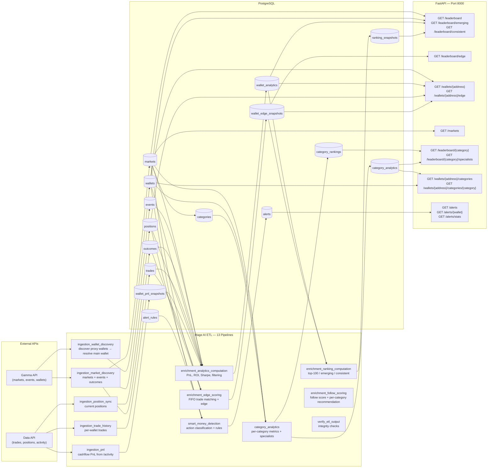

# Architecture

## Data Flow Summary

1. **Ingestion** — Mage AI pipelines pull data from Polymarket's Gamma API (markets, events, wallets), Data API (trades, positions, activity), and CLOB API (resolution prices).
2. **Storage** — Raw and processed data is stored in PostgreSQL across 23 tables.
3. **Enrichment** — Pipelines compute wallet analytics (PnL, ROI, Sharpe), rankings, category-specific metrics, and **edge scoring** (predictive accuracy via FIFO trade matching).
4. **Detection** — The `smart_money_detection` pipeline evaluates position changes, trades, and early entries against configurable rules.
5. **Recommendation** — `enrichment_follow_scoring` combines edge, consistency, specialization, recency and trade frequency into a global and per-category follow score with a `FOLLOW` / `WATCH` / `IGNORE` recommendation.
6. **Delivery** — The FastAPI backend serves the REST API, WebSocket streams, and optional Discord webhook delivery for alerts. Alerts on followed wallets are executed against paper-trading portfolios by a background task on the API process.
7. **Presentation** — A Next.js dashboard (`frontend/`) consumes the REST API and subscribes to the alert WebSocket.

## ETL Pipelines

| Pipeline | Loads | Transforms | Exports |
|---|---|---|---|
| `ingestion_market_discovery` | Gamma `/markets/keyset` | Merge active+resolved, parse outcomes | `events`, `markets`, `outcomes` |
| `ingestion_wallet_discovery` | Data API `/trades` → discover proxy wallets | Gamma `/users/{addr}` resolve | `wallets` |
| `ingestion_position_sync` | Data API `/positions?user=` | Diff vs previous positions | `positions`, `position_history` |
| `ingestion_pnl` | Data API `/activity` (cursor pagination) | Cash-flow PnL formula, category breakdown | `wallet_pnl_snapshots` |
| `ingestion_trade_history` | Data API `/trades?user=` | Dedup by trade id | `trades` |
| `enrichment_analytics_computation` | PG queries (recent activity) | PnL, ROI, Sharpe, win rate | `wallet_analytics` |
| `enrichment_ranking_computation` | PG queries (analytics) | Weighted score, top-100 lists | `ranking_snapshots` |
| `category_analytics` | PG queries (markets + categories) | Per-category PnL, ROI, win rate, specialist flag | `category_analytics`, `category_rankings` |
| `enrichment_edge_scoring` | PG queries (resolved trades + outcomes) | FIFO buy/sell matching, edge per trade, min-max normalization | `wallet_edge_snapshots` |
| `smart_money_detection` | PG queries (position changes, scores, rules) | Classify actions, apply score/size/liquidity thresholds | `alerts` |
| `enrichment_follow_scoring` | PG queries (analytics + category analytics) | Weighted follow score, recency decay, frequency sigmoid | `wallet_analytics.follow_score`, `wallet_category_follow_scores` |
| `orchestration` | — | Sequences the pipelines above | — |
| `verify_etl_output` | PG integrity checks | — | — |
